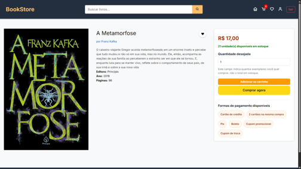
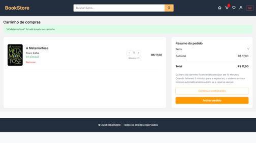
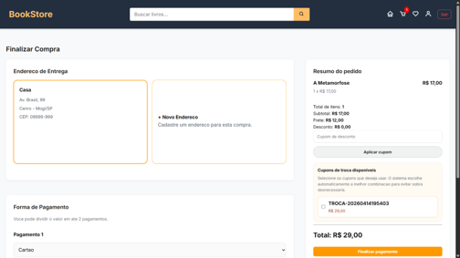
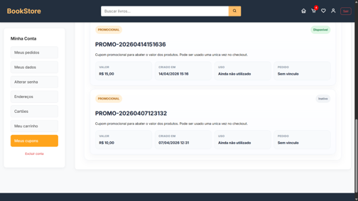
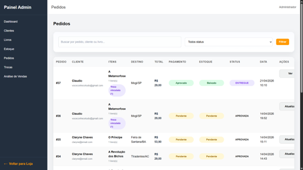

# BookStore

Sistema de livraria desenvolvido em C# com ASP.NET Core MVC, com foco em fluxo completo de e-commerce: catálogo, autenticação, carrinho, checkout, pedidos, trocas, cupons, wishlist, avaliações e painel administrativo.

## Descrição

O projeto simula uma plataforma de venda de livros com experiência tanto para clientes quanto para administradores. A aplicação permite navegar pelo catálogo, visualizar detalhes dos livros, manter carrinho e wishlist, concluir compras com diferentes formas de pagamento, acompanhar pedidos, solicitar trocas e avaliar livros comprados.

Além da experiência do cliente, o sistema possui uma área administrativa com gerenciamento de clientes, livros, estoque, pedidos, trocas, cupons promocionais e análise de vendas. O projeto também inclui um chatbot de recomendação de livros com fallback local e integração opcional com OpenAI.

## Funcionalidades

- Catálogo de livros com busca e página de detalhes
- Cadastro, login e logout de clientes
- Área do cliente com perfil, endereços, cartões e cupons
- Carrinho com reserva temporária de estoque
- Checkout com cálculo de frete, cupons e múltiplas formas de pagamento
- Histórico e detalhamento de pedidos
- Solicitação e acompanhamento de trocas
- Wishlist de livros
- Avaliação de livros comprados
- Painel administrativo para clientes, livros, estoque, pedidos e trocas
- Geração de cupons promocionais
- Análise de vendas
- Chatbot de recomendação de livros

## Tecnologias

- C#
- .NET 8
- ASP.NET Core MVC
- Entity Framework Core 8
- SQL Server
- Razor Views
- Bootstrap
- JavaScript
- BCrypt.Net
- xUnit
- Playwright
- OpenAI API (opcional)

## Arquitetura

A solução está organizada em camadas, separando regras de negócio, persistência, interface web e testes:

### `Livros.Web`

Camada de apresentação da aplicação.

- Controllers MVC
- Views Razor
- ViewModels
- configuração da aplicação
- serviços de sessão e integração com recomendação

### `Livros.Application`

Camada de casos de uso e orquestração das funcionalidades.

Exemplos de módulos:

- `Authentication`
- `Catalog`
- `Checkout`
- `CustomerAccounts`
- `CustomerAddresses`
- `CustomerCards`
- `CustomerCart`
- `CustomerCheckout`
- `CustomerOrders`
- `CustomerWishlist`
- `BookReviews`
- `Recommendations`
- `AdminBooks`
- `AdminCustomers`
- `AdminDashboard`
- `AdminInventory`
- `AdminOrders`
- `AdminExchanges`
- `AdminSalesHistory`
- `SalesAnalysis`

### `Livros.Domain`

Camada com as entidades centrais do domínio.

Principais entidades:

- `Cliente`
- `Endereco`
- `Cartao`
- `Livro`
- `Categoria`
- `Estoque`
- `Pedido`
- `PedidoItem`
- `Pagamento`
- `CupomDesconto`
- `Troca`
- `ReservaCarrinho`
- `Wishlist`
- `WishlistItem`
- `Avaliacao`

### `Livros.Infrastructure`

Camada de persistência e acesso a dados.

- `AppDbContext`
- migrations do Entity Framework Core
- data providers
- bootstrap de categorias e usuário administrador
- integração com SQL Server

### `Livros.Tests`

Projeto de testes automatizados.

- testes com xUnit
- testes com Entity Framework InMemory
- testes E2E com Playwright

## Screenshots

### Home

```md

```

### Detalhes do livro

```md

```

### Carrinho

```md

```

### Checkout

```md

```

### Área do cliente

```md

```

### Painel administrativo

```md

```

### Chatbot de recomendação

```md

```

## Como executar

### Pré-requisitos

- .NET 8 SDK
- SQL Server
- Visual Studio 2022 ou VS Code

### 1. Clonar o repositório

```bash
git clone <https://github.com/Felpopinho13/Livros->
cd Livros
```

### 2. Configurar a connection string

Edite o arquivo `Livros.Web/appsettings.json`:

```json
{
  "ConnectionStrings": {
    "DefaultConnection": "Server=localhost;Database=LivrosDb;Trusted_Connection=True;TrustServerCertificate=True;"
  }
}
```

### 3. Restaurar as dependências

```bash
dotnet restore
```

### 4. Criar ou atualizar o banco de dados

Opção 1, usando migrations:

```bash
dotnet ef database update --project Livros.Infrastructure --startup-project Livros.Web
```

Opção 2, usando o script completo disponibilizado no projeto:

```text
script-banco-completo.sql
```

### 5. Executar a aplicação

```bash
dotnet run --project Livros.Web
```

Depois, abra no navegador a URL informada no terminal.

### 6. Executar os testes

```bash
dotnet test Livros.Tests
```

## Banco de Dados

O projeto utiliza SQL Server como banco relacional principal.

### Banco padrão

- Nome: `LivrosDb`

### Estrutura persistida

Algumas das principais tabelas da aplicação:

- `Clientes`
- `Enderecos`
- `Cartoes`
- `Livros`
- `Categorias`
- `Estoques`
- `Pedidos`
- `PedidoItens`
- `Pagamentos`
- `Trocas`
- `CuponsDesconto`
- `ReservasCarrinho`
- `Wishlists`
- `WishlistItems`
- `Avaliacoes`

### Seed inicial

No bootstrap da aplicação, são carregados:

- categorias padrão do catálogo
- usuário administrador inicial

Credenciais iniciais de desenvolvimento:

- E-mail: `admin@admin.com`
- Senha: `123456`

Recomendação:

- altere essas credenciais em qualquer ambiente fora de desenvolvimento

### OpenAI

Se quiser habilitar recomendações com IA, configure a seção `OpenAI` no `appsettings.json`:

```json
{
  "OpenAI": {
    "ApiKey": "SUA_CHAVE",
    "Model": "gpt-5.4-mini"
  }
}
```

Se a chave não for informada, a aplicação continua funcionando com fallback local para recomendação.

## Licença

Este projeto pode ser apresentado como projeto acadêmico/portfólio. Se desejar disponibilizá-lo publicamente no GitHub, uma boa opção é utilizar a licença MIT.

Exemplo:

```text
MIT License
```

Caso ainda não tenha definido uma licença, você também pode manter temporariamente:

```text
Este projeto foi desenvolvido para fins acadêmicos e de portfólio.
```
